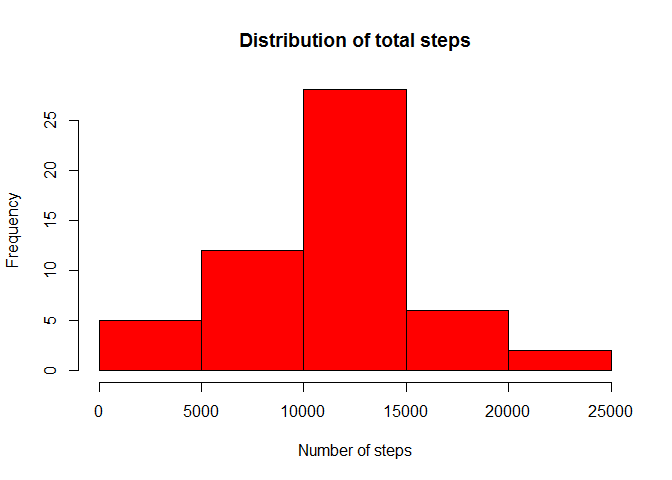
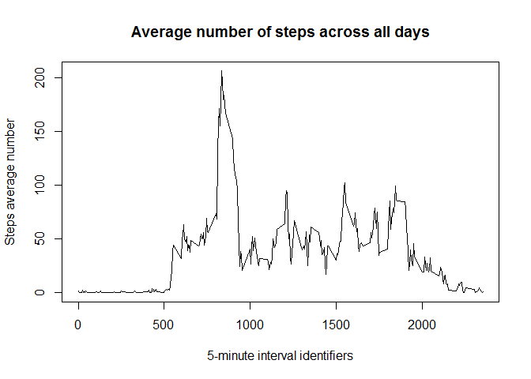
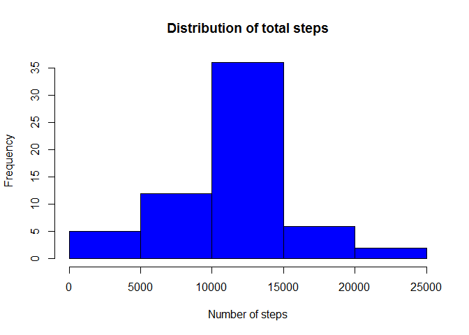
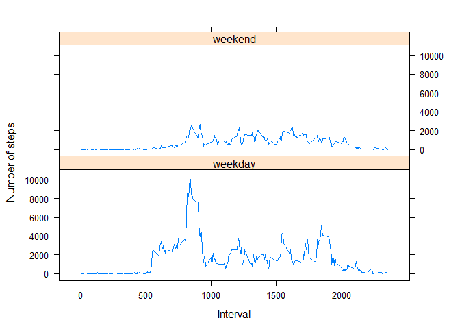

# PA1_template
qingcheng  
Sunday, August 17, 2014  

# Reproducible Research: Peer Assessment 1


## Loading and preprocessing the data

```r
# Assume the [activity.csv] was placed at the same directory as this Rmarkdown 
# file.
data <- read.csv("activity.csv")
data$date<-as.Date(data$date, "%Y-%m-%d")
data_clean<- na.omit(data) 
```


## What is mean total number of steps taken per day?
1. Make a histogram of the total number of steps taken each day

```r
sumdata<-aggregate(steps~date, data_clean, sum)
hist(sumdata$steps,xlab="Number of steps",
     main="Distribution of total steps", col='red')
```

 

2. Calculate and report the mean and median total number of steps taken per day  
* Mean of {total number of steps taken per day}

```r
meanstep = mean(sumdata$steps)
meanstep
```

```
## [1] 10766
```

* Median of {total number of steps taken per day}

```r
medianstep = median(sumdata$steps)
medianstep
```

```
## [1] 10765
```


## What is the average daily activity pattern?
1. Make a time series plot of the 5-minute interval (x-axis) and the average 
number of steps taken, averaged across all days (y-axis)

```r
aggdata1<-aggregate(data_clean,by=list(data_clean$interval),FUN=mean)
plot(aggdata1$interval,aggdata1$steps,type='l',
     xlab="5-minute interval identifiers"
     , main="Average number of steps across all days", 
     ylab="Steps average number")
```

 

2. Which 5-minute interval, on average across all the days in the dataset, 
contains the maximum number of steps?

```r
maxinterval<-aggdata1[which.max(aggdata1$steps),'interval']
maxinterval
```

```
## [1] 835
```


## Imputing missing values
1. Calculate and report the total number of missing values in the dataset
(i.e. the total number of rows with NAs)

```r
sum(is.na(data$steps))
```

```
## [1] 2304
```

2. Devise a strategy for filling in all of the missing values in the dataset. 
The strategy does not need to be sophisticated. For example, you could use 
the mean/median for that day, or the mean for that 5-minute interval, etc.

```r
naRows = which(is.na(data), arr.ind=TRUE)[,1]
repMeanPerInterval = rep(aggdata1$steps,61)
```

3. Create a new dataset that is equal to the original dataset but with the 
missing data filled in.

```r
data_filled = data
data_filled$steps[naRows] = repMeanPerInterval[naRows]
```

4. Make a histogram of the total number of steps taken each day and Calculate 
and report the mean and median total number of steps taken per day. Do these 
values differ from the estimates from the first part of the assignment? What 
is the impact of imputing missing data on the estimates of the total daily 
number of steps?  
* Make a histogram of the total number of steps taken each day

```r
sumdata_filled<-aggregate(steps~date, data_filled, sum)
hist(sumdata_filled$steps,xlab="Number of steps",
     main="Distribution of total steps", col='blue')
```

 

* Mean of {total number of steps taken per day}

```r
meanstep_new = mean(sumdata_filled$steps)
meanstep_new
```

```
## [1] 10766
```

* Median of {total number of steps taken per day}

```r
medianstep_new = median(sumdata_filled$steps)
medianstep_new
```

```
## [1] 10766
```

* Do these values differ from the estimates from the first part of the assignment?


* What is the impact of imputing missing data on the estimates of the total daily number of steps? 


## Are there differences in activity patterns between weekdays and weekends?
#### Yes, less activity over the weekend.


* Create a new factor variable in the dataset with two levels – “weekday” and “weekend” indicating whether a given date is a weekday or weekend day.

```r
library("chron")
data_filled$DayType = ifelse(is.weekend(as.POSIXct(data_filled$date)), 
                             "weekend", "weekday")

tpi = aggregate(steps ~ interval + DayType, data_filled, sum)
```

* Make a panel plot containing a time series plot (i.e. type = "l") of the 5-minute interval (x-axis) and the average number of steps taken, averaged across all weekday days or weekend days (y-axis). 

```r
library(lattice)
xyplot(steps ~ interval | DayType, data=tpi, layout=c(1,2), type="l", ylab="Number of steps", xlab="Interval")
```

 
